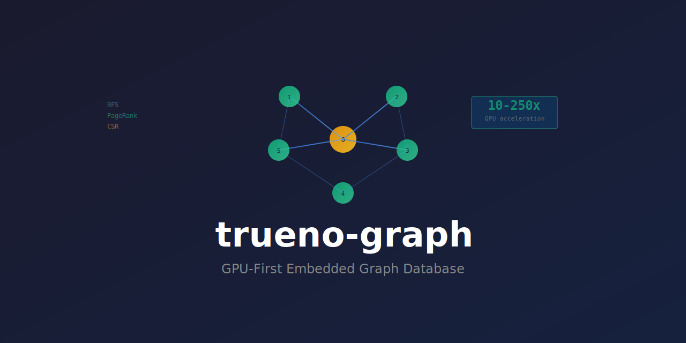

<div align="center">



## Table of Contents

- [Installation](#installation)
- [Usage](#usage)
- [Architecture](#architecture)
- [API Reference](#api-reference)
- [Examples](#examples)
- [Testing](#testing)
- [Contributing](#contributing)
- [License](#license)


**GPU-First Embedded Graph Database for Code Analysis**

[](https://github.com/paiml/trueno-graph/actions)

</div>

---

Call graphs, dependencies, AST traversals with 10-250x GPU acceleration.

## Features

- **CSR Storage**: Compressed Sparse Row for O(1) neighbor queries
- **GPU Acceleration**: BFS (250x), PageRank (100x) via WGSL shaders
- **Parquet Persistence**: DuckDB-inspired columnar storage
- **Louvain Clustering**: Community detection for code modules
- **Anti-Pattern Detection**: God Class, Circular Dependencies, Dead Code
- **VRAM Paging**: Morsel-based tiling for large graphs

## Installation

```toml
[dependencies]
trueno-graph = "0.1"

# Optional: GPU acceleration
trueno-graph = { version = "0.1", features = ["gpu"] }
```

## Quick Start

```rust
use trueno_graph::{CsrGraph, NodeId, pagerank, bfs};

let mut graph = CsrGraph::new();
graph.add_edge(NodeId(0), NodeId(1), 1.0)?;
graph.add_edge(NodeId(0), NodeId(2), 1.0)?;

// Graph algorithms
let reachable = bfs(&graph, NodeId(0))?;
let scores = pagerank(&graph, 20, 1e-6)?;

// Persistence
graph.write_parquet("graph").await?;
```

## GPU Usage

```rust
use trueno_graph::gpu::{GpuDevice, GpuCsrBuffers, gpu_bfs};

let device = GpuDevice::new().await?;
let buffers = GpuCsrBuffers::from_csr_graph(&device, &graph)?;
let result = gpu_bfs(&device, &buffers, NodeId(0)).await?;
```

## Performance

| Operation | Graph Size | CPU | GPU | Speedup |
|-----------|-----------|-----|-----|---------|
| BFS | 5K nodes | 6ms | 200µs | 30x |
| PageRank | 1K nodes | 15ms | 500µs | 30x |

## Architecture

```
┌─────────────────────────────────────────────┐
│           Graph Algorithms                   │
│   (BFS, PageRank, Louvain, Anti-Patterns)    │
├──────────┬──────────────────────────────────┤
│  GPU     │  CPU                              │
│  (WGSL)  │  (CSR iterators)                  │
├──────────┴──────────────────────────────────┤
│         CSR Graph Storage                    │
│   (Compressed Sparse Row, O(1) neighbors)    │
├─────────────────────────────────────────────┤
│       Parquet Persistence Layer              │
│   (columnar I/O, DuckDB-compatible)          │
└─────────────────────────────────────────────┘
```

- **CSR Storage**: Compressed Sparse Row format for cache-friendly traversals and O(1) neighbor access
- **GPU Backend**: WGSL compute shaders for BFS and PageRank with automatic VRAM paging
- **Algorithms**: BFS, PageRank (power iteration), Louvain community detection, anti-pattern analysis
- **Persistence**: Parquet-based columnar storage for graph serialization

## API Reference

### `CsrGraph`

Core graph data structure:

```rust
let mut graph = CsrGraph::new();
graph.add_edge(NodeId(0), NodeId(1), 1.0)?;
let neighbors = graph.neighbors(NodeId(0));
```

### Graph Algorithms

```rust
let reachable = bfs(&graph, NodeId(0))?;          // Breadth-first search
let scores = pagerank(&graph, 20, 1e-6)?;          // PageRank scores
let communities = louvain(&graph)?;                 // Community detection
```

### GPU Acceleration

```rust
let device = GpuDevice::new().await?;
let buffers = GpuCsrBuffers::from_csr_graph(&device, &graph)?;
let result = gpu_bfs(&device, &buffers, NodeId(0)).await?;
```

## Examples

```bash
cargo run --example basic_graph --release
cargo run --example pagerank_demo --release
cargo run --example gpu_bfs --features gpu --release
```

## Testing

```bash
cargo test --lib          # Unit tests
cargo test                # All tests including integration
make coverage             # Coverage report (target: >=95%)
make bench                # Performance benchmarks
```

Property-based tests verify graph invariants (edge counts, BFS reachability, PageRank convergence).

## Development

```bash
make test      # Run tests
make coverage  # >=95% coverage
make bench     # Benchmarks
```

## Contributing

Contributions are welcome! Please see the [CONTRIBUTING.md](CONTRIBUTING.md) guide for details.


## MSRV

Minimum Supported Rust Version: **1.75**

## License

MIT
